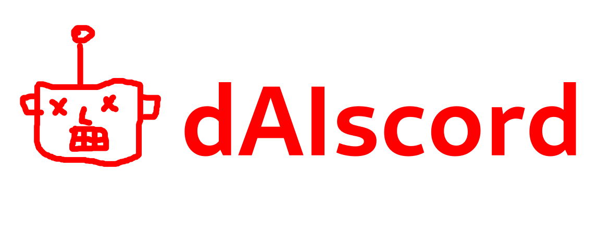

# Interact with ChatGPT from Discord

dAIscord allows you to add custom AI bots to your server. An OpenAI API key is required.

# Usage with Docker Compose

You can now use Docker Compose to orchestrate multiple bots for your server and easily deploy them:

`$ cat ./docker-compose.yml`

```
version: '3'

services:
  macron:
    build: .
    environment:
      DISCORD_TOKEN: your-discord-token
      AI_TOKEN: your-openai-token
      AI_MODEL: gpt-3.5-turbo
      PREPROMPT: "Bonjour Macron"
  borne:
    build: .
    environment:
      DISCORD_TOKEN: your-discord-token
      AI_TOKEN: your-openai-token
      AI_MODEL: gpt-3.5-turbo
      PREPROMPT: "Bonjour Borne"
```

Simply run the following command:

`$ docker compose up -d`

The bot should go online and answer user messages.

Since the bot's message history is global, do not use the same bot on different servers. Users could leak message history, and the bot will behave as if everyone is on the same server.

# Reset conversations

From the Discord chat, use the `!reset` command to reset the chat history. Give the bot some time to run the pre-prompt again.

# Technical details

Built using [Node.JS](https://nodejs.org/en).

The Docker image is based on [Alpine Linux](https://www.alpinelinux.org/)